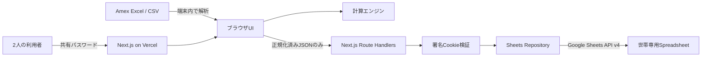

# ふたりの家計室 技術要件書

| 項目 | 内容 |
|---|---|
| 文書版 | 1.4 |
| 作成日 | 2026-08-15 |
| 対象 | Next.js / Vercel / Google Sheets API構成 |
| 参照 | `requirements-definition.md` |

## 1. 技術方針

- フレームワークはNext.js App Routerを使用する。
- 実行基盤はVercelとする。
- 専用DBは使用せず、Google Sheets API v4を永続化層として使用する。
- Excelはブラウザ内で解析し、生ファイルをサーバーへ送らない。
- 計算処理は副作用のない純粋関数として実装し、UIおよびSheets通信から分離する。
- Google Sheets固有の処理はRepository層へ閉じ込め、将来の保存先変更に備える。

## 2. 採用技術

| 分類 | 採用技術 | 要件 |
|---|---|---|
| Webフレームワーク | Next.js 16.3.1 | App Router、Route Handlers、Node.js Runtime |
| UI | React 19.2.6 / TypeScript 5.9 | Client Componentは操作部分に限定する |
| ホスティング | Vercel | Production / Previewを分離する |
| Excel解析 | read-excel-file 9.3.x | `.xlsx` をブラウザで解析する |
| CSV解析 | アプリ内パーサー | BOM、引用符、CRLFに対応する |
| 認証 | scrypt + jose | 共有パスワードのハッシュ照合とJWTセッション。認証DBは不要 |
| 永続化 | Google Sheets API v4 | `values.get`、`values.update`、`values.clear`、`batchUpdate` を使用する |
| Google認証 | Service Account | SpreadsheetをService Accountへ共有する |
| テスト | Node.js Test Runner | 計算ロジック、取込ルール、構成契約をテストする |

Next.js 16.3.1はNode.js 20.9.0以上を前提とする。本システムはVercel上での予期しないメジャー更新を避けるためNode.js 22.xに固定し、Route HandlerにはNode.js Runtimeを使用する。Edge Runtimeは採用しない。

## 3. システム構成



### 3.1 責務

| レイヤー | 責務 |
|---|---|
| UI | ファイル選択、明細確認、手入力、結果表示、シナリオ編集 |
| Parser | 行8以降の読込、列C/D/F/Hの抽出、金額・文字列正規化 |
| Calculation Engine | 対象判定、合計、按分、短期支出予測、最長600か月のライフプラン計算 |
| Route Handlers | 認証、入力検証、Repository呼出、HTTP応答 |
| Sheets Repository | `state_YYYY-MM`シートの初期化、分割JSONの読込・更新、revision競合検知 |
| Google Spreadsheet | 1世帯分の月別アプリ状態を永続化し、Google標準の変更履歴を保持 |
| Wishlist Repository | 欲しいものを `wishlist` シートへ保存し、revisionで同時更新を検知 |
| Personal Assets Repository | 個人資産を `personal_assets_YYYY-MM` シートへ月別保存し、revisionで同時更新を検知 |

## 4. ディレクトリ構成

```text
app/
  api/
    auth/login/route.ts
    auth/logout/route.ts
    state/route.ts
    history/route.ts
    wishlist/route.ts
    admin/auth/route.ts
    admin/assets/route.ts
  login/
    page.tsx
    login-form.tsx
  lib/
    auth.ts
    finance.ts
    life-plan.ts
    wishlist.ts
    personal-assets.ts
    login-rate-limit.ts
    sheets.ts
    state.ts
  life-plan-panel.tsx
  page.tsx
  layout.tsx
  globals.css
proxy.ts
scripts/
  hash-password.mjs
  generate-session-secret.mjs
tests/
  *.test.ts
  *.test.mjs
docs/
```

## 5. Google Spreadsheet設計

アプリは既存Spreadsheetに対象月の `state_YYYY-MM` シートを自動作成し、その月の状態を分割JSONとして保存する。対象月は日本時間の前月であり、月次締めボタン押下時に `closedAt` を保存する。1セルあたりの文字数上限を避けるため、JSONは30,000文字ごとに分割する。過去の単一状態形式である `app_state` は、最初の締め対象月への初回アクセス時に下書きとして読み込み、締め時に対象月タブへ保存する。

| 列 | 内容 |
|---|---|
| A `key` | 固定値 `household` |
| B `chunk_index` | 0始まりの分割番号 |
| C `payload_chunk` | JSONの分割文字列。`RAW`で書き込む |
| D `updated_at` | ISO 8601更新日時 |
| E `revision` | 更新ごとのUUID |

保存JSONは `version`、`revision`、`updatedAt`、`state` を持つ。`state` にはAmex明細、手入力費用、短期シミュレーション条件、ライフプラン入力、ファイル名を含める。ライフプランの計算結果は保存せず、読込後に入力値から再計算する。保存前に現在のrevisionを照合し、不一致時はHTTP 409で上書きを拒否する。SheetはトランザクションDBではないため、単一世帯・低頻度更新を前提とする。

## 6. API要件

金融データを扱うAPIは署名済みセッションCookieを検証し、成功応答を含め `Cache-Control: private, no-store` を返す。

| Method | Path | 用途 |
|---|---|---|
| POST | `/api/auth/login` | 共有パスワードを照合し、セッションCookieを発行 |
| POST | `/api/auth/logout` | セッションCookieを削除 |
| GET | `/api/state?month=YYYY-MM` | Google Sheetsから対象月の状態、締め状態、revisionを取得 |
| PUT | `/api/state?month=YYYY-MM` | expectedRevisionを照合し、対象月の状態と締め状態を保存 |
| DELETE | `/api/state?month=YYYY-MM` | expectedRevisionを照合し、対象月の保存状態を削除 |
| GET | `/api/history` | 締め済みの月別履歴を取得 |
| GET | `/api/wishlist` | 欲しいものリストとrevisionを取得 |
| PUT | `/api/wishlist` | 欲しいものリストをrevision照合後に保存 |
| POST | `/api/admin/auth` | 個人資産用パスワードを照合し、管理者セッションCookieを発行 |
| DELETE | `/api/admin/auth` | 管理者セッションCookieを削除 |
| GET | `/api/admin/assets?month=YYYY-MM` | 管理者セッション検証後に対象月の個人資産と保存済み月一覧を取得 |
| PUT | `/api/admin/assets?month=YYYY-MM` | 管理者セッション、対象月、revisionを検証して個人資産と計算結果を保存 |

### 6.1 入力検証

- 金額は安全な整数範囲内の日本円とする。
- 割合は0〜100とする。
- リクエストボディは4MBを上限とする。
- Sheetsへは `RAW` で書き込み、数式として解釈させない。
- 保存状態はサーバー側の型ガードで検証する。
- Excelの元行番号は8以上とする。
- 欲しいもののカテゴリは1〜100文字、名称は1〜255文字、金額は0円以上とする。
- 欲しいもののURLは空欄または`http` / `https`のURLだけを許可する。

## 7. 認証・認可

- Googleログイン、Google OAuth、Auth.jsは使用しない。
- 共有パスワードは平文保存せず、scrypt形式のハッシュだけを `APP_PASSWORD_HASH` に保持する。
- ログイン成功時はHS256署名JWTをHttpOnly Cookieへ保存し、有効期間は7日とする。
- CookieはProductionでSecure、常にSameSite=Lax、Path=/とする。
- Next.js Proxyで画面とAPIを保護し、`/api/state` でもCookieを再検証する。
- ログイン失敗は同一実行インスタンス内で15分5回までに制限する。Vercel Firewallを追加防御として使用できる。
- Google Sheets APIはService Accountを使用する。
- SpreadsheetをService Accountのメールアドレスへ編集者として共有する。
- パスワードハッシュ、Cookie署名鍵、Service Account private keyはVercel Environment VariablesへSensitive値として登録する。
- `NEXT_PUBLIC_` 接頭辞を秘密情報に付けない。

## 8. 環境変数

| 変数 | 秘密 | 用途 |
|---|---|---|
| `APP_PASSWORD_HASH` | はい | `npm run auth:hash` で生成するscryptハッシュ |
| `ADMIN_PASSWORD_HASH` | はい | 個人資産エリア専用。`npm run auth:hash` で生成するscryptハッシュ |
| `SESSION_SECRET` | はい | `npm run auth:secret` で生成するJWT署名鍵。32文字以上 |
| `GOOGLE_SHEETS_SPREADSHEET_ID` | 準秘密 | 対象Spreadsheet ID |
| `GOOGLE_SERVICE_ACCOUNT_EMAIL` | 準秘密 | Service Account JSONの `client_email`。Spreadsheetの共有先 |
| `GOOGLE_SERVICE_ACCOUNT_PRIVATE_KEY` | はい | Service Account JSONの `private_key`。実改行と `\n` 表記の両方に対応 |

ProductionとPreviewで値を分離する。Previewでは本番Spreadsheetを使用せず、検証用Spreadsheetを指定する。

## 9. Google Sheets API実装要件

- 締め対象月へのアクセス時は `spreadsheets.get` で `state_YYYY-MM` の存在を確認し、なければ `spreadsheets.batchUpdate` で作成する。
- 読込は `spreadsheets.values.get` を使用する。
- 更新前に `spreadsheets.values.clear` を行い、`spreadsheets.values.update` でヘッダーと分割行を書き込む。
- Repository内で2次元配列をドメイン型へ変換し、UIへSheet行を露出しない。
- SheetはトランザクションDBではないため、単一世帯・低頻度更新を前提とする。
- 更新前に `revision` を比較する楽観的同時実行制御を行い、不一致時は再読込を促す。
- 書込失敗時はUIの編集内容を保持し、再送可能にする。
- `wishlist` シートはA〜G列にID、名称、カテゴリ、金額、URL、更新日時、revisionを保存する。
- 欲しいものリストの更新もrevisionを比較し、別端末の更新を上書きしない。
- `personal_assets_YYYY-MM` シートは月次状態と同じ分割JSON形式で、対象月の給料、予備資金、口座、メイン口座、投資、個人支出、残るお金、総資産、投資可能額を保存する。予備資金は対象月ごとに0円以上で自由に変更でき、新規月のみ初期値10万円を使用する。旧 `personal_assets` シートは月別保存への移行元として読み込む。
- 個人資産APIは共有セッションに加えて管理者セッションCookieを検証し、CookieはHttpOnly・SameSite=Strictとする。

## 10. Excel解析要件

- 解析処理はClient Component内で実行する。
- 列位置はC=2、D=3、F=5、H=7の0始まりインデックスで扱う。
- 8行目以降は `rows.slice(7)` で処理する。
- 文字列はNFKC正規化、連続空白の単一化、前後空白除去を行う。
- 金額は通貨記号、カンマ、全角文字、括弧付き負数を解釈する。
- H列は `null` かどうかで空欄判定し、0を空欄扱いしない。
- 保存前に対象件数、除外件数、合計を利用者へ提示する。
- 生ファイル内容をログ、Analytics、エラー監視へ送信しない。

## 11. シミュレーション要件

- 計算関数は入力とモードから結果を返す純粋関数とする。
- 節約はAmexとその他変動費へ `1 - scenarioSwing` を乗算する。
- 基準は現在値を使用する。
- ゆとりはAmexとその他変動費へ `1 + scenarioSwing` を乗算する。
- 家賃・固定費を含む全項目へ、年間上昇率を月次複利換算して適用する。
- 一時支出は指定した月に1回だけ加算する。
- 計算結果は原則クライアントで算出し、保存を選択した場合のみ前提をSheetsへ保存する。

### 11.1 ライフプラン計算

- 精算台帳と世帯キャッシュフローを分離し、精算相手への請求額を世帯支出として二重計上しない。
- 計画期間は120、240、360、480、600か月から選択する。
- 月次順序は、収入・支出計算、投資積立可能額調整、運用、必要時の投資取崩し、現預金・純資産確定とする。
- 投資積立は現預金から投資への資産振替とし、純資産上の費用にしない。
- 現預金が最低残高を割る場合は積立額を減らし、それでも不足する場合は投資を取り崩す。
- 純資産は `現預金 + 投資残高 + 住宅価値 - ローン残高` とする。
- 収入は二人別の手取り、賞与、昇給率、退職月、年金開始月から算出する。
- 共通費負担は50%ずつ、可処分手取り比例、任意割合を提供する。
- ライフイベントは一時費用と期間付き継続費用を持ち、世帯・本人・パートナーの負担者を持つ。
- 緊急資金は `現預金 ÷ 必須生活費` で判定し、初期目標は6か月とする。
- 住宅ローンは元利均等返済とし、金利0%も処理する。
- 教育費は幼児教育、小学校、中学校、高校、大学の年齢帯と、公立中心・混合・私立中心の概算プリセットを使用する。
- 退職後は給与を停止し、年金開始後は年金を加算する。二人とも退職した後は老後生活費と医療介護予備費を使用する。
- 悲観は昇給率-1ポイント・物価+1ポイント・運用-2ポイント、楽観は昇給率+1ポイント・物価-0.5ポイント・運用+2ポイント、基準は入力値どおりとする。
- 600か月×3シナリオをブラウザ内で即時計算し、表示は年次集約と重要月抽出を使用する。

## 12. Vercel要件

- Framework PresetはNext.jsとする。
- Install Commandは `npm ci`、Build Commandは `npm run build` とする。
- Node.js Runtimeは22.xに固定する。
- Production Branchは `main` とする。
- デプロイはVercel CLIの手動アップロードではなく、private GitHubリポジトリとのGit連携を正式経路とする。
- GitHubのコミット、Pull Request、Vercel Deploymentを相互に追跡可能にする。
- Preview Deploymentは検証用環境変数を使用する。
- Route HandlersはNode.js Runtimeとし、ローカルファイルへの永続書込を行わない。
- 金融データをVercel Analyticsへイベント送信しない。
- 本番公開前に共有パスワード認証とAPI保護が有効であることを確認する。

## 13. セキュリティ要件

- OWASP Top 10を基準に入力検証と出力エスケープを行う。
- Spreadsheet Formula Injectionを防止する。
- Content Security Policy、`X-Content-Type-Options: nosniff`、`Referrer-Policy` を設定する。
- セッションCookieはHttpOnly、Secure、SameSite=Lax以上とする。
- APIエラーにSpreadsheet ID、Service Accountメール、秘密鍵、スタックトレースを含めない。
- ログにはリクエストID、処理種別、成功／失敗、所要時間のみを残し、明細・金額・氏名を残さない。
- 依存関係の脆弱性監査をリリース前に実行する。

## 14. テスト要件

| 種別 | 対象 |
|---|---|
| Unit | 氏名一致、ETC、前回振替除外、H列優先、0円、返金、按分、短期予測、月次収支、投資振替、イベント、教育費、住宅ローン |
| Parser | XLSX、CSV、BOM、引用符、空行、全角、金額文字列 |
| Repository | Sheet行とドメイン型の相互変換、append、batchUpdate、重複検知 |
| API | 未認証、パスワード不一致、入力エラー、revision競合、Sheets権限エラー |
| Integration | 取込→確認→保存→再読込→補正→確定 |
| E2E | パスワードログイン、月次精算、ライフプラン入力・再計算、Sheets再読込、ログアウト、スマートフォン表示 |

必須の計算受入テストは要件定義書の計算例と一致させる。

## 15. 運用・障害対応

- Spreadsheetの変更履歴をバックアップとして利用し、必要に応じて定期コピーを作成する。
- シート列構成変更時は `schema_version` を更新し、移行スクリプトを用意する。
- Google APIの429発生時は利用者へ時間を置いた再試行を案内する。
- 認証エラーは再ログイン、権限エラーはSpreadsheet共有設定の確認へ誘導する。
- Vercel Previewで動作確認後にProductionへ昇格する。

## 16. 現在の実装との差分

| 項目 | 現在 | 本番要件 |
|---|---|---|
| フレームワーク | 標準Next.js 16へ移行済み | 継続 |
| ホスティング | Vercel CLIでモック公開済み | GitHub連携Productionへ切替待ち |
| 保存 | Google Sheets API実装済み | 環境変数設定後に接続確認 |
| 認証 | 共有パスワード・署名Cookie実装済み | ハッシュと署名鍵の設定待ち |
| 履歴 | `state_YYYY-MM` タブへ月別保存、`closedAt`を保持、`/api/history`で表示 | 精算結果のエクスポートは将来拡張 |
| 複数端末 | revision付き最新状態を共有 | 実Spreadsheetで結合テスト待ち |
| ライフプラン | 10機能の月次計算・入力・結果表示を実装済み | 実データ入力後の前提調整待ち |

Google Sheets API接続には、Spreadsheet ID、Service Accountのメールアドレスとprivate key、共有パスワードハッシュ、セッション署名鍵の準備が必要である。GitHub公開はSSH remote `git@github.com:harukishimo/money.git` を使用し、GitHub CLI認証を必須としない。

## 17. 参考資料

- [Next.js App Router documentation](https://nextjs.org/docs/app)
- [Vercel Next.js documentation](https://vercel.com/docs/frameworks/nextjs)
- [Google Sheets API documentation](https://developers.google.com/workspace/sheets/api/guides/concepts)
- [参考ライフプランシミュレーター](https://kaaaichi.github.io/lifeplan-simulator/)
- [参考リポジトリ](https://github.com/kaaaichi/lifeplan-simulator)
